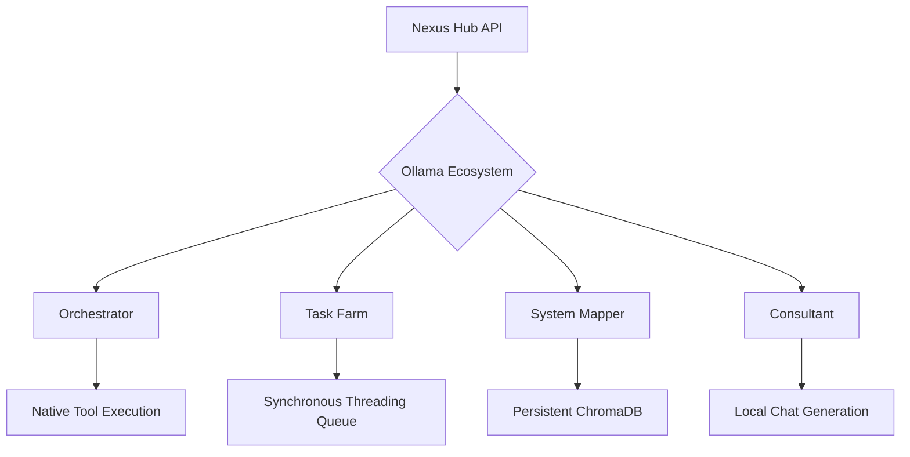

<div align="center">
  
# 🧠 Nexus Hub (Local Intelligence Hub)

[](https://python.org)
[](https://opensource.org/licenses/MIT)

A unified Monolithic API Server for Ollama. Combines `local-model-consultant`, `local-task-farm`, `ollama-tool-orchestrator`, and `ollama-system-mapper` into a single, mathematically optimal architecture derived by the Multiverse Planner.

[Installation](#installation) •
[Usage](#usage) •
[Architecture](#architecture)

</div>

---

## 🛑 The Problem

Running multiple local Ollama tools simultaneously (like a consultant CLI, a background orchestrator server, a separate SQLite database for codebase mapping, and an asynchronous task queue) creates immense fragmentation and resource contention. 

## 💡 The Solution

**The Nexus Hub** is a Monolithic API Server that provides a unified control plane for your local intelligence stack. By relying on a single backend, Native Ollama Functions, and a Persistent ChromaDB store, you can achieve `<10ms` latency routing without system bloat.

---

## ⚙️ Architecture



---

## 🚀 Installation

Install directly via `pip` or use `uv`.

```bash
git clone https://github.com/axtontc/local-intelligence-hub
cd local-intelligence-hub
pip install .
```

Ensure you have a local Ollama instance running.

---

## 💻 Usage (CLI)

Start the monolithic server:
```bash
nexus serve --port 8080
```

Trigger specific subsystems from the CLI:
```bash
nexus map --dir ./my_project
nexus farm --queue ./tasks.json
nexus consult --prompt "How do I optimize this architecture?"
```

---

## 📄 License

This project is licensed under the MIT License - see the [LICENSE](LICENSE) file for details.
